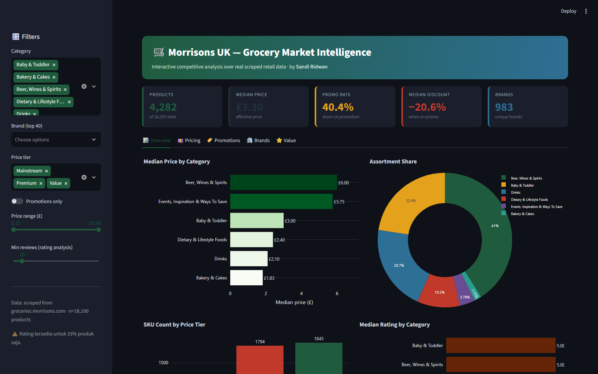
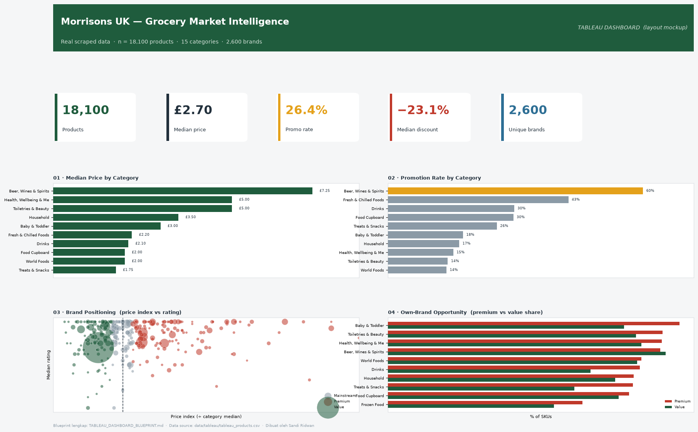
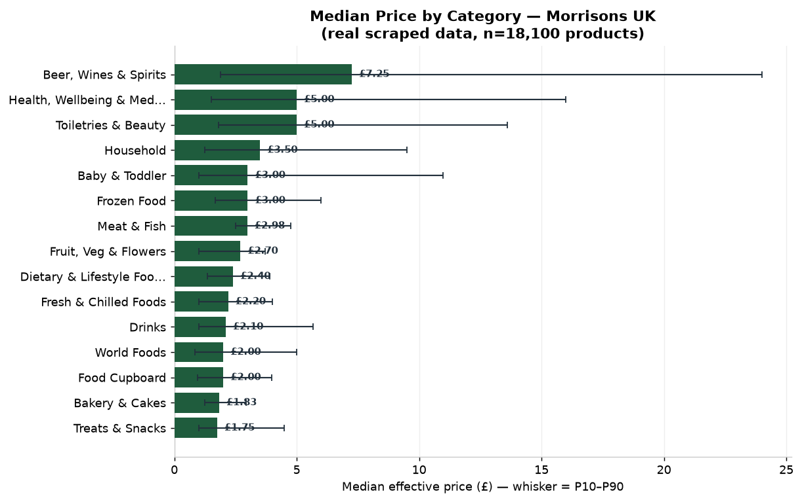
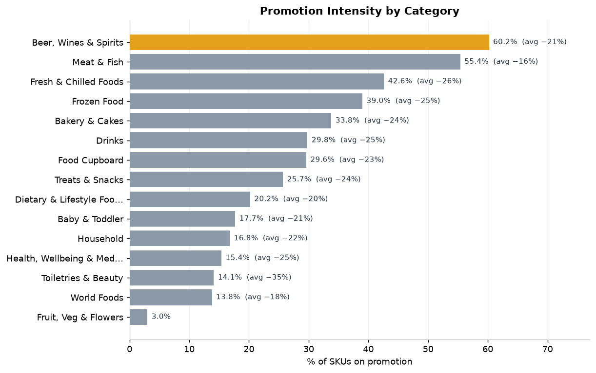
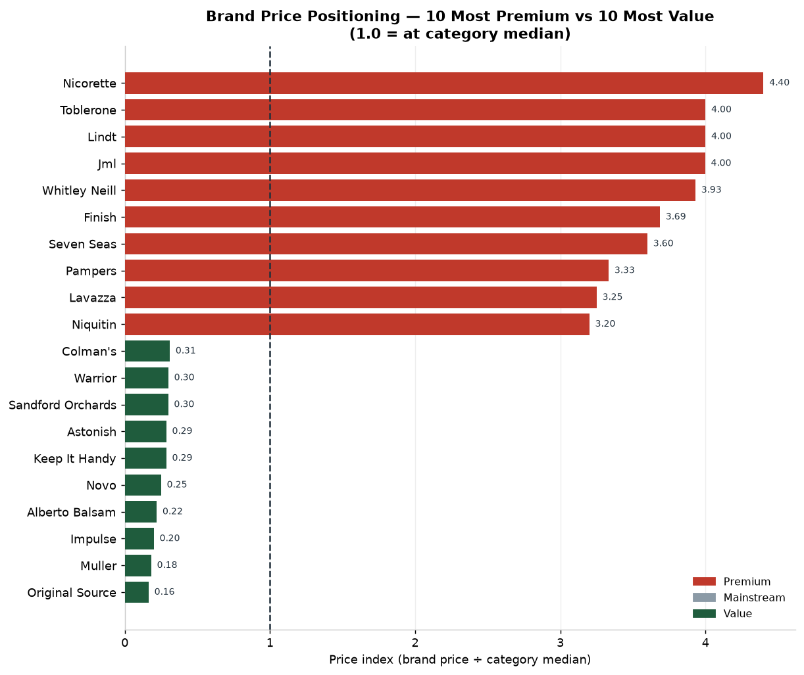
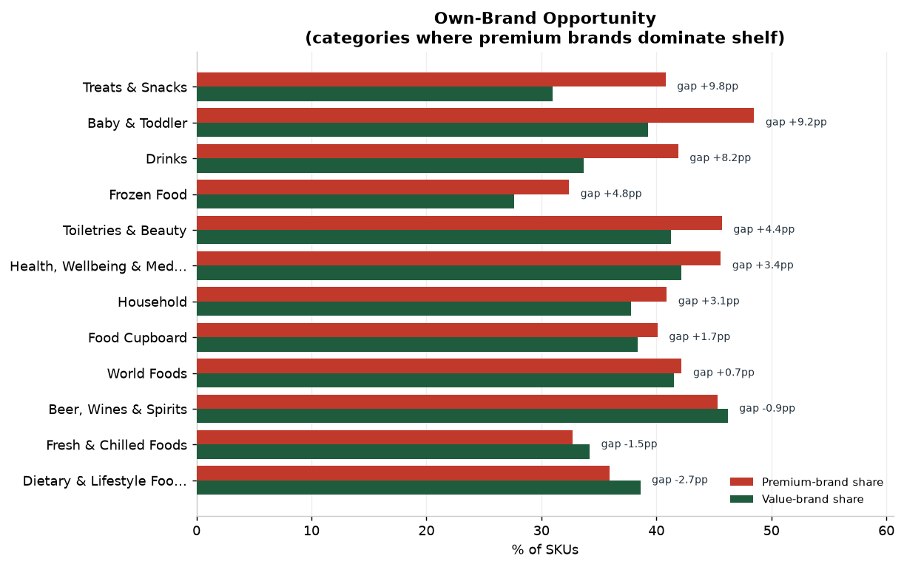
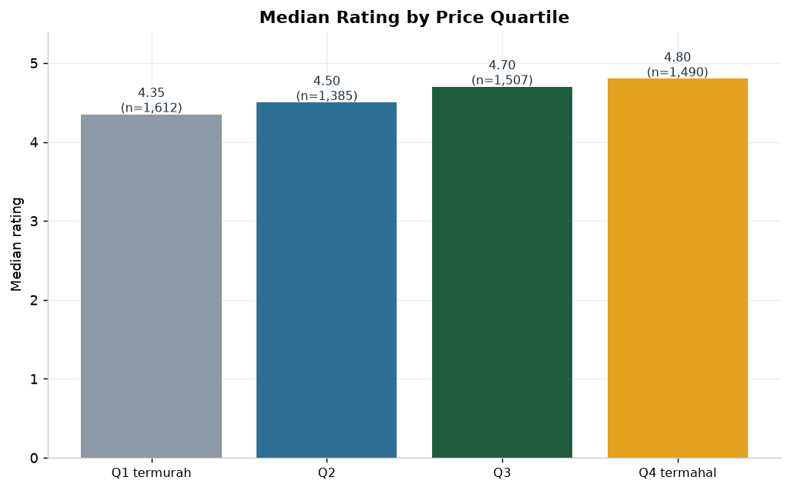
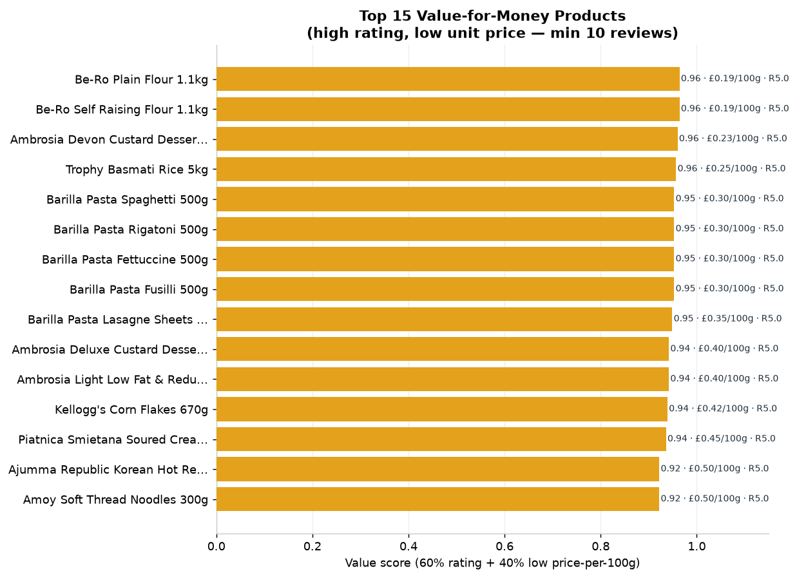

# 🛒 Morrisons UK — Grocery Market Intelligence

**Analisis kompetitif atas 18.100 produk ritel dari groceries.morrisons.com — dari data web yang sulit didapat menjadi insight bisnis yang dapat ditindaklanjuti.**

[](https://python.org)
[](https://pandas.pydata.org)
[](LICENSE)

---

## 📖 Ringkasan

Proyek ini adalah **studi end-to-end data analyst**: mengambil data harga produk
dari supermarket Morrisons UK, membersihkannya, lalu menghasilkan analisis
kompetitif yang dapat ditindaklanjuti oleh tim pricing, marketing, atau product.

Melanjutkan pipeline pengumpulan data dari repo
[`morrisons-product-scraper`](https://github.com/SandiRidwan/morrisons-product-scraper)
(reverse-engineering API internal + Playwright).

> 📄 **Laporan lengkap: [`REPORT.md`](REPORT.md)**

---

## 🎯 Pertanyaan Bisnis

| # | Pertanyaan | Insight |
|---|-----------|---------|
| Q1 | Bagaimana struktur harga antarkategori? | Alkohol termahal & paling bervariasi (spread 305%) |
| Q2 | Seberapa agresif promosi tiap kategori? | Alkohol 60% & Meat 55% SKU promo |
| Q3 | Brand mana premium vs value? | Nicorette 4.4× vs Original Source 0.16× |
| Q4 | Apakah harga mencerminkan kualitas? | ρ=0.08 → praktis tidak ada hubungan |
| Q5 | Di mana peluang private-label terbesar? | Treats & Snacks, Baby, Drinks (gap +8–10pp) |

---

## 📊 Hasil Visualisasi

### 🖥️ Interactive Dashboard (Streamlit + Plotly)



Dashboard web interaktif dengan filter real-time (kategori, brand, tier harga, promo, range harga) dan 5 tab analisis. Detail: **[`app/README.md`](app/README.md)**.

```bash
streamlit run app/dashboard.py     # buka http://localhost:8501
```

### 🖥️ Dashboard Layout (Tableau Blueprint)



> Layout dashboard interaktif + spesifikasi lengkap (sheet, calculated fields,
> interaksi) ada di **[`TABLEAU_DASHBOARD_BLUEPRINT.md`](TABLEAU_DASHBOARD_BLUEPRINT.md)**.

### Chart Analisis

| Harga antarkategori | Intensitas promosi |
|:---:|:---:|
|  |  |

| Positioning brand | Peluang private-label |
|:---:|:---:|
|  |  |

| Harga vs kualitas | Produk value terbaik |
|:---:|:---:|
|  |  |

---

## 🔬 Sorotan Teknis

**1. Parsing data semi-terstruktur.**
Informasi paling berharga tersembunyi di dalam *string*, bukan kolom rapi:

```python
"£3.20"                          -> price = 3.20
"Unit Price: £8.00 per kg"       -> unit_price=8.00, basis="kg"
"Rating: 4.6 (12 reviews)"       -> rating=4.6, reviews=12
"Promotions: Now £1.75, Was £2"  -> promo_price=1.75, discount=12.5%
```

**2. Deteksi jebakan harga.**
Kolom `Price` utama ternyata = harga tampilan (sering = "Was"), sedangkan harga
promo nyata ada di field teks `others3`. Mengabaikan ini akan melebih-lebihkan
harga secara sistematis → logika pemulihan ditulis & diuji di `morrisons_parser.py`.

**3. Normalisasi harga lintas-kategori.**
Membandingkan harga brand mentah (biskuit vs sampanye) menyesatkan. Dipakai
**price index** = harga ÷ median kategori-nya untuk perbandingan yang adil.

**4. Analisis & presentasi dipisah.**
Logika di `analysis.py` (murni, reusable), visualisasi di `make_charts.py`.
Ini pola engineering, bukan script sekali pakai.

---

## 🗂️ Struktur Proyek

```
morrisons-market-intelligence/
├── app/
│   ├── dashboard.py            # 📊 Interactive Streamlit dashboard
│   └── README.md
├── src/
│   ├── morrisons_parser.py     # bronze -> silver: parsing data mentah
│   ├── analysis.py             # 15+ fungsi insight (murni, reusable)
│   ├── make_charts.py          # 10 visualisasi
│   ├── run_analysis.py         # orkestrator end-to-end (1 perintah)
│   ├── build_notebook.py       # generator notebook
│   └── generate_sample_data.py # data sintetis (demo tanpa data klien)
├── notebooks/
│   └── morrisons_market_intelligence.ipynb
├── data/
│   ├── raw/                    # CSV mentah hasil scrape
│   ├── processed/              # CSV bersih
│   └── tableau/                # extract siap-impor Tableau (+ calculated fields)
├── reports/
│   ├── figures/                # 11 chart PNG (termasuk mockup dashboard)
│   ├── tables/                 # 10 tabel insight CSV
│   └── summary.json            # ringkasan metrik
├── TABLEAU_DASHBOARD_BLUEPRINT.md   # spesifikasi dashboard Tableau
├── REPORT.md                   # laporan bisnis lengkap
└── requirements.txt
```

---

## ⚙️ Cara Menjalankan

```bash
# 1. Install dependensi
pip install -r requirements.txt

# 2. Siapkan data mentah di data/raw/morrisons_products.csv
#    (atau, untuk demo tanpa data asli:)
python src/generate_sample_data.py

# 3. Parse -> bersih
python src/morrisons_parser.py

# 4. Jalankan analisis + export semua tabel
python src/run_analysis.py

# 5. Buat semua visualisasi
python src/make_charts.py

# 6. (opsional) buat ulang notebook
python src/build_notebook.py
```

---

## 🛠️ Tech Stack

`Python` · `pandas` · `numpy` · `matplotlib` · `regex` · `Streamlit` · `Plotly`
· terkait pengumpulan data: `Playwright` · `mitmproxy` · `curl_cffi` · `Docker`

---

## ⚠️ Disclaimer

Data digunakan untuk tujuan edukasi & portofolio. Scraping selalu patuh pada
ToS situs, `robots.txt`, dan rate limit.

---

## 📬 Kontak

**Sandi Ridwan** — Data Automation Engineer · Web Scraping Specialist · Python

[GitHub](https://github.com/SandiRidwan) · [LinkedIn](https://www.linkedin.com/in/sandi-ridwan/) · [Upwork](https://www.upwork.com/freelancers/~011f6d0fbb4a372974) · [Tableau Public](https://public.tableau.com/app/profile/sandi.ridwan)
