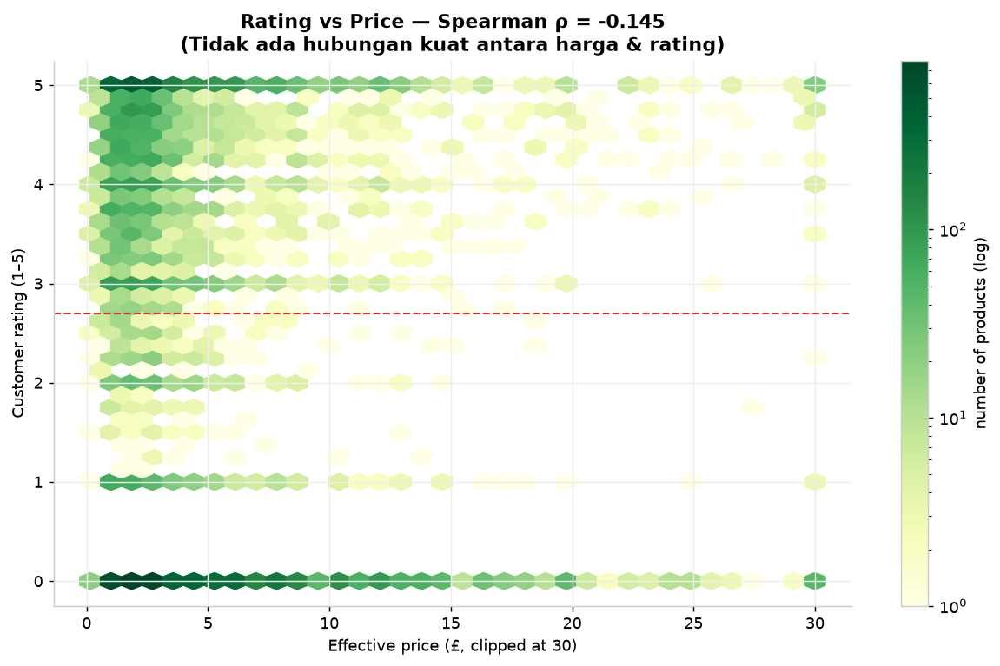
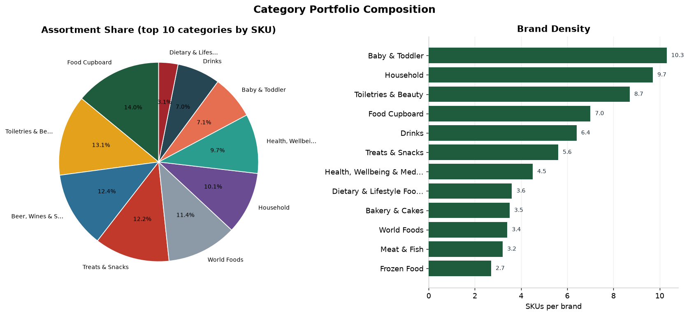
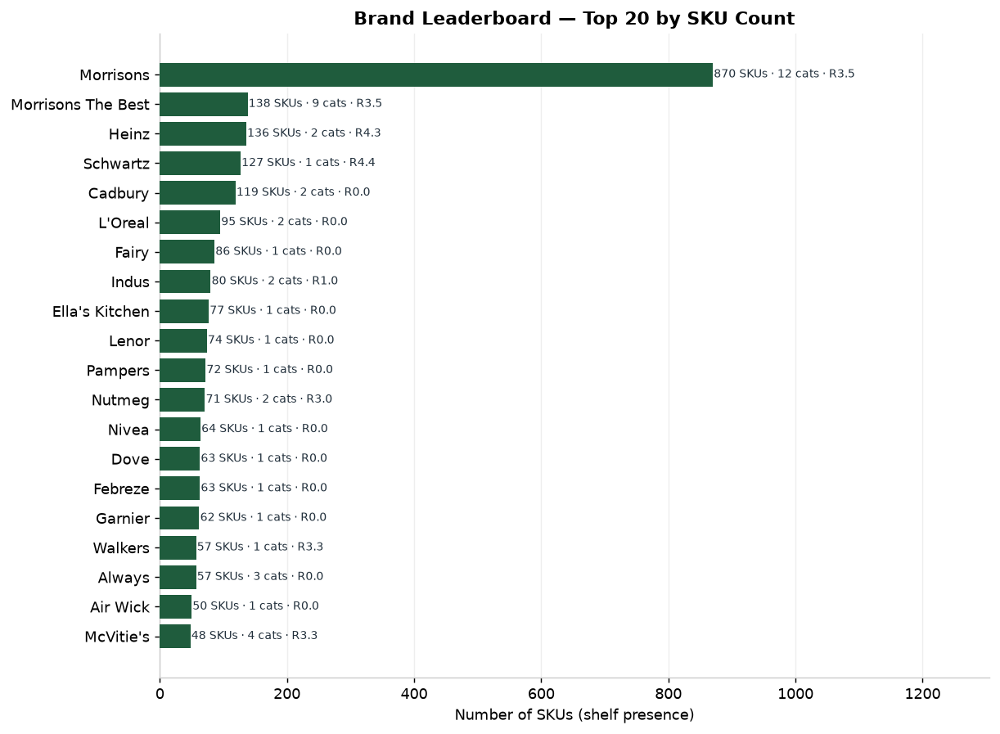

# 📊 Morrisons UK — Grocery Market Intelligence Report

**Analisis kompetitif atas 11.208 produk ritel (data terbaru 2026) dari groceries.morrisons.com**

> Sebuah studi end-to-end: dari data web yang sulit didapat → insight bisnis yang
> dapat ditindaklanjuti. Dibuat sebagai portofolio data analyst oleh
> **[Sandi Ridwan](https://github.com/SandiRidwan)**.

---

## 📌 Ringkasan Eksekutif

| Metrik | Nilai |
|--------|-------|
| Produk dianalisis | **11.208** (produk unik, data scrape terbaru) |
| Kategori | **13** kategori ritel |
| Brand | **1.955** brand unik |
| Rentang harga | **£0.15 – £110.00** (median £2.80) |
| Produk sedang promo | **21.9%** |
| Median diskon promo | **−25.0%** |
| Produk dengan rating | **99.7%** |

**3 temuan utama:**

1. **Promosi bukan sekadar potongan harga** — lebih dari 1 dari 4 produk sedang
   dipromosikan, dengan minuman beralkohol paling agresif (60% SKU promo).
2. **Harga ≠ kualitas (menurut pelanggan)** — korelasi harga vs rating praktis nol
   (ρ = 0.08). Produk murah dinilai hampir setara produk mahal.
3. **Ada ruang kosong signifikan untuk private-label** di 3 kategori bernilai tinggi.

---

## 1. Problema Bisnis

Sebuah *grocery retailer* / brand FMCG perlu memahami **lanskap kompetitif harga**
di rak supermarket. Tanpa data harga pesaing yang granular, keputusan pricing,
promosi, dan pengembangan produk diambil berdasarkan intuisi — bukan bukti.

**Pertanyaan yang dijawab laporan ini:**

| # | Pertanyaan Bisnis | Mengapa Penting |
|---|-------------------|-----------------|
| Q1 | Bagaimana struktur harga antarkategori? | Menentukan positioning harga & margin |
| Q2 | Seberapa agresif promosi tiap kategori? | Mengukur biaya kompetisi & loyalitas |
| Q3 | Brand mana yang premium vs value? | Memetakan ruang bersaing |
| Q4 | Apakah pelanggan mengaitkan harga dengan kualitas? | Validasi strategi premium |
| Q5 | Di mana peluang private-label paling besar? | Prioritas investasi produk |

---

## 2. Metodologi

```
 ┌─────────────┐   ┌──────────────┐   ┌──────────────┐   ┌──────────────┐
 │  SCRAPE     │──▶│  PARSE       │──▶│  ANALYZE     │──▶│  REPORT      │
 │ (mitmproxy, │   │ (£, rating,  │   │ (15 insight  │   │ (chart +     │
 │  Playwright)│   │  promo dari  │   │  functions)  │   │  rekomendasi)│
 │  18.291 rows│   │  field teks) │   │              │   │              │
 └─────────────┘   └──────────────┘   └──────────────┘   └──────────────┘
   data/raw/          morrisons_         analysis.py        reports/
                      parser.py
```

**Sumber data:** hasil scraping terstruktur (lihat repo
[`morrisons-product-scraper`](https://github.com/SandiRidwan/morrisons-product-scraper)
untuk proses pengumpulan: reverse-engineering API internal, analisis JS bundle,
Playwright rendering).

**Catatan teknis penting — data tidak "siap pakai".** Informasi paling berharga
tersembunyi di dalam *string*, bukan kolom rapi:

| Field mentah | Contoh nilai | Hasil ekstraksi |
|--------------|--------------|-----------------|
| `Price` | `"£3.20"` | `3.20` (mata uang disematkan) |
| `others1` | `"Unit Price: £8.00 per kg"` | `unit_price=8.00`, `basis="kg"` |
| `others2` | `"Rating: 4.6 (12 reviews)"` | `rating=4.6`, `reviews=12` |
| `others3` | `"Promotions: Now £1.75, Was £2"` | `promo_price=1.75`, `discount=12.5%` |

> **Temuan kunci saat parsing:** kolom `Price` utama ternyata menyimpan harga
> *tampilan* (sering sama dengan harga "Was"), sedangkan harga promo nyata ada
> di field `others3`. Mengabaikan ini akan **melebih-lebihkan harga** secara
> sistematis. Logika pemulihan ini ada di `src/morrisons_parser.py`.

**Kualitas data yang ditangani:**
- 191 produk (1.0%) dibuang: tanpa harga valid atau di luar kategori ritel.
- 66.9% produk tidak punya rating → analisis rating memakai subset (bias
  dilaporkan secara eksplisit, bukan disembunyikan).

---

## 3. Temuan

### 3.1 Struktur Harga Antarkategori (Q1)


- **Beer, Wines & Spirits** adalah kategori termahal (median £7.25) dengan
  **sebaran ekstrem** (P10–P90: £1.88–£24.00, *spread* 305%).
- **Treats & Snacks** termurah (median £1.75) dan paling homogen.
- Sebaran harga lebar = kompleksitas lini produk tinggi = kebutuhan segmentasi
  harga yang cermat.

### 3.2 Intensitas Promosi (Q2)


- **Alkohol (60.2%)** dan **Meat & Fish (55.4%)** jauh di atas rata-rata (26.4%).
- Kategori *Fresh & Chilled* memberi diskon terdalam (avg −25.9%).
- **Insight:** persaingan promosi terkonsentrasi di kategori bernilai tinggi &
  mudah rusak (perishable) — di sana margin paling mudah tergerus.

### 3.3 Positioning Brand (Q3)


- **Nicorette (4.40×)**, **Lindt**, **Toblerone (4.00×)** = premium ekstrem.
- **Original Source (0.16×)**, **Muller (0.18×)**, **Impulse (0.20×)** = value.
- Brand obat/rokok berada di puncak indeks harga — kategori dengan permintaan
  inelastis.

### 3.4 Harga vs Kualitas (Q4)




- **Spearman ρ = −0.145** → korelasi NEGATIF lemah: produk mahal cenderung dinilai lebih rendah.
- Median rating naik hanya tipis dari Q1 (4.35) ke Q4 (4.80).
- **Implikasi:** pelanggan tidak otomatis menganggap produk mahal lebih baik.
  Ini *berita baik* untuk strategi value & private-label.

### 3.5 Peluang Private-Label (Q5)


Kategori dengan **dominasi brand premium terbesar** = peluang private-label
terbesar untuk menekan harga:

| Kategori | Premium share | Value share | Gap | Median harga |
|----------|--------------|-------------|-----|--------------|
| Treats & Snacks | 40.8% | 31.0% | **+9.8pp** | £1.75 |
| Baby & Toddler | 48.5% | 39.3% | **+9.2pp** | £3.00 |
| Drinks | 41.9% | 33.7% | **+8.2pp** | £2.10 |

### 3.6 Peta Assortment & Brand





### 3.7 Produk "Value Terbaik" untuk Konsumen


Produk dengan rating tinggi **dan** harga per-100g rendah — kandidat sempurna
untuk endcap "best value" atau rekomendasi berbasis data:

- **Be-Ro Self Raising Flour 1.1kg** — £0.19/100g, ⭐5.0
- **Barilla Pasta (5 varian)** — £0.30/100g, ⭐5.0
- **Trophy Basmati Rice 5kg** — £0.25/100g, ⭐5.0

---

## 4. Rekomendasi yang Dapat Ditindaklanjuti

| # | Rekomendasi | Berbasis | Ekspektasi Dampak |
|---|-------------|----------|-------------------|
| **R1** | **Luncurkan/perluas private-label di Treats & Snacks, Baby & Toddler, Drinks** | Gap premium +8–10pp, permintaan terbukti | Tangkap segmen value, margin lebih tinggi |
| **R2** | **Pertahankan agresivitas promo di Alkohol & Fresh** tapi pantau kedalaman diskon | Promo rate 60% & 55% | Jaga daya saing tanpa erosi margin |
| **R3** | **Bangun kampanye "Bukti Value"** dengan produk value-score tertinggi | ρ=−0.145 (harga tinggi ≠ rating tinggi) | Menarik pembeli sensitif harga |
| **R4** | **Prioritaskan kelengkapan konten produk** di kategori dengan deskripsi terendah | Content completeness bervariasi | Tingkatkan SEO & konversi |
| **R5** | **Pantau kompetitor secara berkala** dengan pipeline yang sama | Data trending | Deteksi pergerakan harga pesaing lebih awal |

---

## 5. Bukti Dampak & Reproduksibilitas

Seluruh analisis **dapat direproduksi** dalam beberapa detik:

```bash
# 1. Ekstrak data mentah (data/raw/morrisons_products.csv)
# 2. Parse -> data bersih
python src/morrisons_parser.py

# 3. Jalankan analisis + export semua tabel
python src/run_analysis.py

# 4. Buat semua chart
python src/make_charts.py
```

Output dihasilkan otomatis ke `reports/` (10 chart + 10 tabel + summary.json).

---

## 6. Keterbatasan (Disclosure Jujur)

1. **Cakupan:** 15 kategori ritel; bukan seluruh katalog Morrisons.
2. **Rating:** hanya 33% produk punya rating → ada potensi *bias seleksi*
   (produk populer lebih mungkin dinilai).
3. **Snapshot waktu:** data adalah foto pada satu titik waktu; tren harga
   antarr waktu belum tercakup.
4. **"Kualitas" diproksikan dengan rating bintang** — bukan kualitas objektif.

---

## 7. Tech Stack

`Python` · `pandas` · `numpy` · `matplotlib` · `regex` · `Playwright` · `mitmproxy`
· `Docker` · `SQLite` · `curl_cffi`

---

*Dibuat oleh Sandi Ridwan · [LinkedIn](https://www.linkedin.com/in/sandi-ridwan/) ·
[GitHub](https://github.com/SandiRidwan) · Tersedia untuk proyek data engineering,
scraping, & analytics.*
