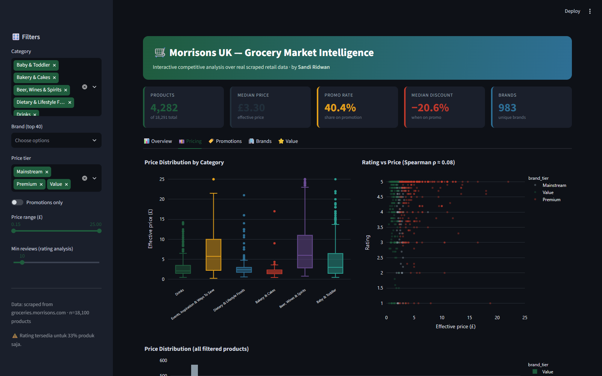

# 📊 Morrisons Market Intelligence — Interactive Dashboard

Dashboard interaktif berbasis **Streamlit + Plotly** atas **18.100 produk** ritel
Morrisons UK hasil scraping.


---

## 🚀 Menjalankan

```bash
# dari root project
pip install -r ../requirements.txt
streamlit run app/dashboard.py
```

Buka `http://localhost:8501`.

---

## 🎛️ Fitur

**Sidebar filter (semua saling terhubung):**
- Kategori (multi-select)
- Brand (top 40)
- Price tier (Premium / Mainstream / Value)
- Toggle "Promotions only"
- Range harga (£)
- Min reviews (untuk analisis rating)

**5 tab:**

| Tab | Isi |
|-----|-----|
| 📊 **Overview** | Median harga per kategori, assortment share (donut), SKU per tier, median rating |
| 💷 **Pricing** | Box plot sebaran harga, scatter rating-vs-harga, histogram harga |
| 🏷️ **Promotions** | Promo rate per kategori, kedalaman diskon, tipe promo, scatter harga-vs-diskon |
| 🏢 **Brands** | Top 20 brand, positioning brand (price index vs rating), premium vs value share |
| ⭐ **Value** | Leaderboard value-for-money + tabel detail |

**KPI band real-time** — berubah mengikuti filter: Produk · Median harga · Promo rate · Median diskon · Jumlah brand.

---

## 📸 Screenshot

| Overview | Pricing |
|:---:|:---:|
|  |  |

---

## 🧠 Catatan Analitis

- **`effective_price`** dipakai untuk semua perhitungan harga (harga yang
  benar-benar dibayar), bukan kolom `price` (harga tampilan). Lihat
  [`REPORT.md`](../REPORT.md) §2.
- **`price_index`** & **`brand_tier`** dihitung di app (harga ÷ median kategori)
  agar perbandingan brand lintas-kategori adil.
- **Rating hanya tersedia untuk 33% produk** — keterbatasan ini ditampilkan
  eksplisit di sidebar & footer dashboard.
- **`value_score`** = 60% rating tinggi + 40% harga-per-100g murah.

---

## ☁️ Deploy Gratis (Streamlit Cloud)

1. Push project ke GitHub (app sudah ada di `app/dashboard.py`)
2. Buka [share.streamlit.io](https://share.streamlit.io) → New app
3. Pilih repo → main file: `app/dashboard.py`
4. Deploy → dapat URL publik `https://<nama>.streamlit.app`

> ⚠️ Pastikan `data/processed/morrisons_clean.csv` ikut ter-commit (ukuran ~2 MB,
> masih wajar untuk GitHub) ATAU sesuaikan path data.

---

*Dibuat oleh Sandi Ridwan · bagian dari project `morrisons-market-intelligence`.*
